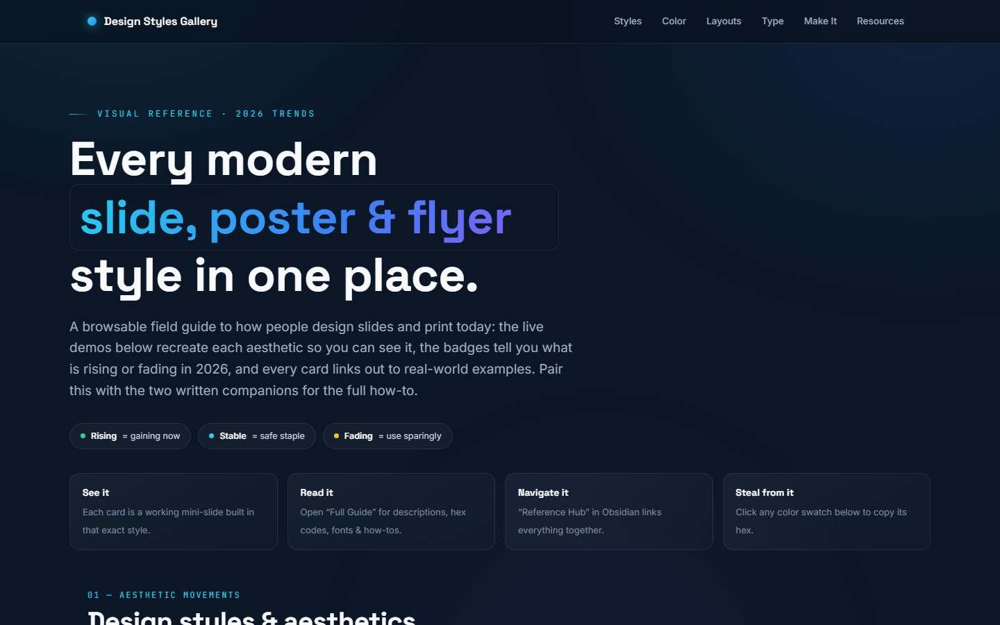

# Slide & Poster Design Reference

A browsable field guide to every modern design style for slides, posters, and flyers — with live CSS demos, copy-on-click color palettes, font specimens, layout wireframes, and step-by-step build guides.

## What's inside

| File | What it is |
|---|---|
| `Design Styles Gallery.html` | Main gallery — open in a browser |
| `Slide & Poster Design — Full Guide.md` | Deep-dive text companion (Obsidian / Markdown) |
| `Slide & Poster Design — Reference Hub.md` | Obsidian hub with cheat sheets |

## Styles covered

Glassmorphism · Dark mode/dark-glass · Aurora/mesh gradient · Bento grid · Neubrutalism · Swiss/International · Editorial/serif · Assertive minimalism · Maximalism/dopamine · Kinetic/big type · Claymorphism · Neumorphism · Y2K/retro · Vaporwave/synthwave · Organic/blob · Anti-design

## Usage

Open `Design Styles Gallery.html` directly in a browser — no build step. Click any color swatch to copy its hex. Each style card links to live real-world examples.

## 2026 meta-trend

Most rising styles are a reaction against AI sameness. Raw, hand-made looks (neubrutalism, anti-design, Y2K, kinetic type) are surging because they read as made by a person. On the polished side, three defaults settled in: **bento grids, dark mode, aurora gradients**.
